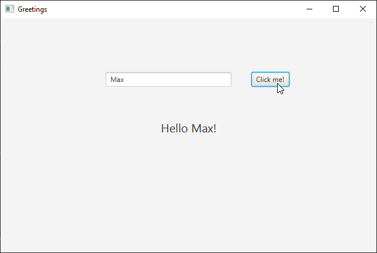

# Simple MVVM Greeter

Very simple JavaFX FXML application that uses the MVVM (Model-View-ViewModel) pattern.

Model:
* GreetingModel

View:
* hello.fxml - FXML definition
* HelloView - "code behind" the fxml, binds fxml with ViewModel

ViewModel
* HelloViewModel
